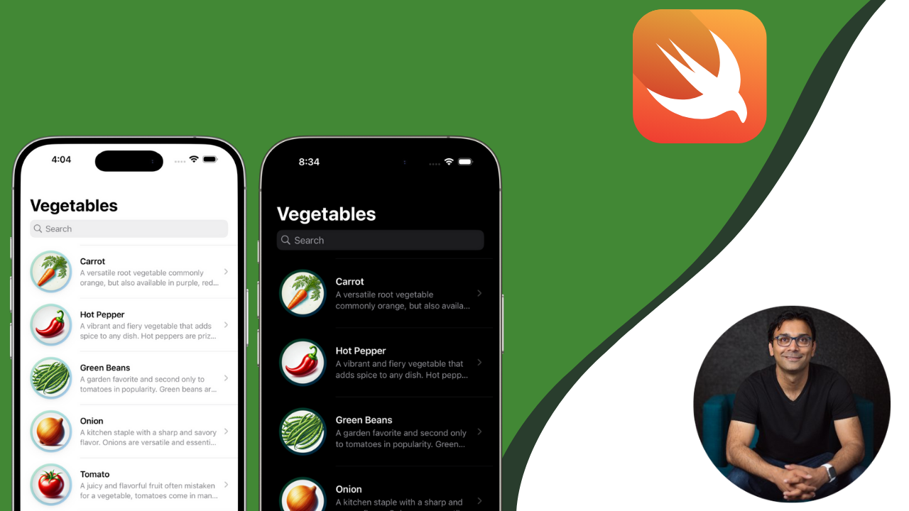

# GreenThumb

### **Build a Complete Vegetable Gardening App with SwiftUI and SwiftData**  

This course teaches you how to build a fully functional vegetable gardening app using **SwiftUI** and **SwiftData**. You'll learn how to structure your app using SwiftUI’s built-in patterns while leveraging SwiftData for offline data persistence. Whether you're new to SwiftUI or looking to enhance your skills, this course provides **practical, real-world experience** in building a feature-rich application.  

---

### **What You Will Learn**  

✅ **SwiftUI Patterns and Best Practices** – Learn how to structure and build a scalable SwiftUI app.  

✅ **Fetching Data from an API** – Dynamically download vegetable information from a JSON API.  

✅ **Offline Data Management with SwiftData** – Allow users to add vegetables to their garden and persist data offline.  

✅ **Tracking Harvesting Time** – Implement features to monitor vegetable growth and notify users when it’s time to harvest.  

✅ **Adding Notes and Images** – Let users add text notes, select images from the photo library, and capture photos using the camera.  

✅ **Displaying Pest Information** – Provide details on common pests and their impact on different vegetables.  

✅ **Search Functionality** – Implement a search feature to quickly find vegetables and pests.  

✅ **Light and Dark Mode Support** – Ensure a seamless user experience across different themes.  

---

By the end of this course, you'll have a **fully functional gardening app** and a solid understanding of how to use **SwiftUI and SwiftData** to build real-world applications.  

🌱 **Start building your gardening app today!** 🚀  